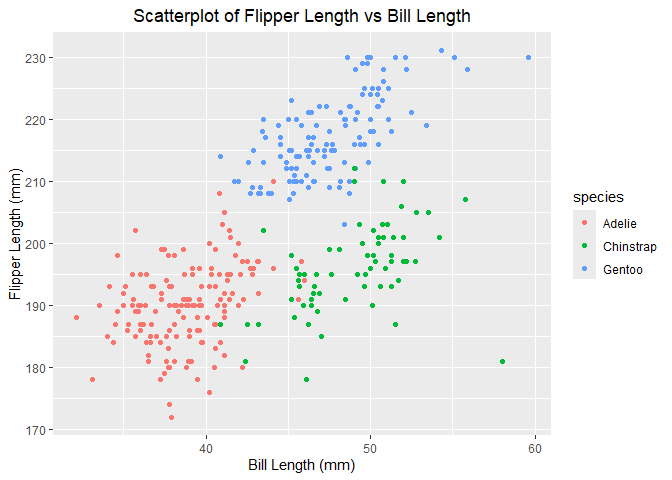

p8105_hw1_sg4489
================
sg4489
2024-09-15

# Problem 1

Load penguins dataset:

``` r
data("penguins", package = "palmerpenguins")
```

The penguins dataset has 344 rows, 8 columns. The important variables
include species (Adelie, Gentoo, and Chinstrap), island (Torgersen
Island, Biscoe Island, and Dream Island), bill length, flipper length,
and body mass. The mean flipper length is 200.9152047 mm.

``` r
# Draw the scatterplot
ggplot(penguins, aes(x = bill_length_mm, y = flipper_length_mm, color = species)) +
  geom_point() +
  labs(
    title = "Scatterplot of Flipper Length vs Bill Length",
    x = "Bill Length (mm)", 
    y = "Flipper Length (mm)") +
  theme(plot.title = element_text(hjust = 0.5))
```

<!-- -->

The plot above shows flipper length against bill length for penguins in
the dataset.  
Colored by species, the plot reveals three distinct clusters. Penguins
of the same species generally share similar bill and flipper lengths:
Adelies have the shortest, Chinstraps the longest flippers, and Gentoos
the longest bills. While the clusters are well-defined, there is some
variation within each, indicating considerable individual differences.  
There also appears to be a positive correlation between bill length and
flipper length.

# Problem 2

Here we create is a data frame comprised of:  
a random sample of size 10 from a standard Normal distribution;  
a logical vector indicating whether elements of the sample are greater
than 0;  
a character vector of length 10;  
a factor vector of length 10, with 3 different factor “levels”.

``` r
set.seed(10) # Set a seed to ensure reproducible results

# Generate data and create a data frame
df <- data.frame(
  random_sample = rnorm(10),
  logical_vector = rnorm(10) > 0,
  character_vector = c("a", "b", "c", "d", "e", "1", "2", "3", "4", "5"),
  factor_vector =  factor(rep(c("low", "medium", "high"), length.out = 10))
)
```

We can calculate the mean for numeric and logical variables (TRUE is
considered as 1 and FALSE is considered as 0), but we cannot calculate
the mean for character vectors and factor vectors.

``` r
mean_values <- df %>%
  summarise(
    random_sample_mean = mean(pull(df, random_sample), na.rm = TRUE),
    logical_vector_mean = mean(pull(df, logical_vector), na.rm = TRUE),
    character_vector_mean = NA, # Characters_vectors cannot be averaged
    factor_vector_mean = NA # Factor_vectors cannot be averaged
  )
```

Mean of the numeric variable is -0.4906568;  
mean of the logical variable is 0.7.

Next, we apply the as.numeric function to logical, character, and factor
variables:

``` r
as.numeric(df$logical_vector) 
as.numeric(df$character_vector)
```

    ## Warning: NAs introduced by coercion

``` r
as.numeric(df$factor_vector)
```

As you can see, as.numeric:  
1. In logical vector, converts TRUE to 1 and FALSE to 0. This happens
because TRUE and FALSE are treated as binary values (1 and 0
respectively) in numeric contexts.  
2. In character vector, as.numeric result in NA values and a warning,
because character strings cannot be directly converted to numbers unless
they represent valid numeric values.  
3. Factor vectors are converted to their underlying integer codes.
Factor levels “low”, “medium”, “high” will be converted to 1, 2, 3.

To summary:  
1. For logical variables, averaging makes sense because TRUE and FALSE
are treated as 1 and 0, so the average reflects the proportion of TRUE
values.  
2. For character variables, averaging can lead to errors because they
usually cannot be directly converted to numeric values.  
3. For factor variables, averaging computes the average of the
underlying integer encoding, which is usually not meaningful because
factor levels do not always have a clear numerical relationship.
